# Hayyacom WhatsApp Messaging Engine — Complete Engineering Analysis

> **Document type:** Principal-engineer architecture review + production-readiness audit  
> **Scope:** Full engine analysis — architecture, reliability, concurrency, security, scalability, and production readiness  
> **Source:** `messaging-engine.md` implementation plan  
> **Analyst:** Senior distributed-systems architecture review

---

## Table of Contents

1. [Executive Summary](#1-executive-summary)
2. [System Goals](#2-system-goals)
3. [High-Level Architecture](#3-high-level-architecture)
4. [Core Components](#4-core-components)
5. [Request Lifecycle](#5-request-lifecycle)
6. [Event-Driven Architecture](#6-event-driven-architecture)
7. [Data Layer Analysis](#7-data-layer-analysis)
8. [State Management](#8-state-management)
9. [Reliability & Fault Tolerance](#9-reliability--fault-tolerance)
10. [Concurrency Analysis](#10-concurrency-analysis)
11. [Scalability Analysis](#11-scalability-analysis)
12. [Security Analysis](#12-security-analysis)
13. [Performance Analysis](#13-performance-analysis)
14. [Operational Concerns](#14-operational-concerns)
15. [Weaknesses & Risks](#15-weaknesses--risks)
16. [Refactoring Recommendations](#16-refactoring-recommendations)
17. [Production Readiness Review](#17-production-readiness-review)

---

## 1. Executive Summary

### What It Does

The Hayyacom WhatsApp Messaging Engine is a **multi-tenant, event-driven, asynchronous outbound messaging system** responsible for sending WhatsApp messages to wedding and event guests via the Twilio WhatsApp Business API. It covers the full message lifecycle: dispatch, delivery, status tracking, retry, expiry, and DLQ alerting.

Message types it handles:
- **Invitation** — initial event invitation with QR/serial number
- **Entrance Card** — guest-specific entrance image with QR code
- **Reminder** — pre-event nudge (time-gated, only to confirmed guests)
- **ThankYou** — post-event gratitude message (time-gated)
- **RSVP-related** — RsvpConfirmation, RejectConfirmation (org-level, triggered by button clicks)
- **Support** — canned reply to free-text guest messages
- **Special / SaveTheDate / Greeting / RegularAuto** — additional event-level types

### Why It Exists

The platform connects Arabic-market event organizers with guests at scale. WhatsApp is the dominant messaging channel in the target region (Middle East / GCC). Email open rates are low; SMS lacks rich media. WhatsApp with approved templates and interactive buttons is the only viable channel for RSVP flows, real-time attendance tracking, and entrance-card delivery.

### Architectural Style

**Hybrid architectural style** combining:

| Style | Where Applied |
|---|---|
| **Vertical Slice Architecture** | Feature organization inside the monorepo |
| **CQRS** | REST commands + GraphQL queries, strict separation |
| **Domain-Driven Design (DDD)** | Aggregate roots, value objects, domain events |
| **Transactional Outbox Pattern** | Atomic write + deferred external dispatch |
| **Event-Driven (domain events)** | Cross-slice communication without coupling |
| **Worker / Queue pattern** | Hangfire job queues, separated API ↔ Worker processes |
| **Token Bucket Rate Limiting** | Per-pod Twilio rate control |
| **Circuit Breaker** | Fault isolation from Twilio failures |

### Key Design Philosophy

> **"Fire-and-forget with guaranteed eventual delivery."**

The API layer commits fast and shallow (validate → persist → enqueue outbox entry). All heavy resolution — template lookup, parameter rendering, media URL resolution, conversation-window check, Twilio call — happens asynchronously in the Workers. This minimizes P99 latency on the hot path and gives the retry machinery maximum leverage over transient failures.

The **Transactional Outbox Pattern** is the load-bearing reliability primitive. Every other reliability feature (PhasedRetry, exponential backoff, StuckMessageReconciliation, ExpiredMessageCleanup, DLQ alerting) is a layered safeguard around it.

---

## 2. System Goals

### Functional Goals

| Goal | Design Choice |
|---|---|
| Send Invitation, Entrance, Reminder, ThankYou, RSVP messages via WhatsApp | `TemplateBusinessType` enum + unified `MessageDeliveryService` |
| Support bulk sends to 1,000+ guests atomically | `EnqueueBulkAsync` — single transaction, batch DB load |
| Handle inbound guest replies (button clicks, free text) | `IncomingMessageProcessor` + `ButtonPayloadCommandResolver` |
| Respect WhatsApp 24h conversation window for cost optimization | `WhatsappConversationWindow` entity + delivery path branching |
| Auto-send Reminder/ThankYou when time gates open | `ScheduledMessageSendJob` (hourly) |
| Provide DLQ visibility and manual retry | `FailedMessageAlertJob` + `POST /{id}/retry` endpoint |
| Track full message status lifecycle with audit trail | `InviterEventGuestMessageLog` with `Source = Internal/Webhook` |

### Non-Functional Goals

| Goal | Target | Mechanism |
|---|---|---|
| **Throughput** | 1,000+ messages/minute (~17/sec) | Bulk queue, parallel workers, rate limiter at 80/sec |
| **Zero message loss** | 0 lost messages | Transactional Outbox Pattern |
| **Webhook response latency** | < 100ms | Immediate 200 OK + async Hangfire enqueue |
| **Delivery rate** | ≥ 99.9% | PhasedRetry (9 attempts) + webhook-driven backoff retry |
| **API availability** | High | API stateless, horizontal scale, separate from Workers |
| **Worker availability** | High | Health checks on `/health/live` + `/health/ready`, K8s probes |

### Reliability Goals

- **Atomic dispatch:** message record + outbox entry committed in one PostgreSQL transaction
- **At-least-once delivery:** Hangfire + PhasedRetry guarantees at-least-once job execution
- **Idempotent Twilio sends:** `IdempotentTwilioRestClient` with `messageId` as the idempotency key prevents duplicate WhatsApp messages on Hangfire retries
- **Self-healing:** `StuckMessageReconciliationJob` rescues messages stuck > 30 minutes
- **TTL-bounded:** `ExpiresAt` prevents post-event message delivery

### Consistency Goals

- **Within-message consistency:** all state mutations (status, log, outbox) committed in one `UnitOfWorkBehavior` transaction
- **Cross-database eventual consistency:** MainDB → HangfireDB transition is explicitly eventual via the outbox dispatcher (no 2PC)
- **Webhook ordering:** forward-progress transitions are the *design intent* but **currently disabled** (known gap)

---

## 3. High-Level Architecture

### Deployment Topology

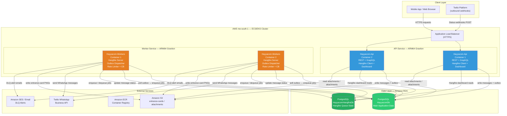

### Project Dependency Graph

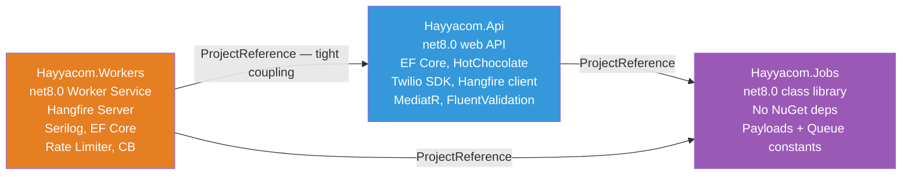

> **Architectural note:** The `WORKERS → API` project reference is explicitly called out in the docs as a **pragmatic decision** ("refactor later if needed"). This means Workers pulls in all API dependencies (HotChocolate, Twilio SDK registration code, etc.) even though it only needs domain entities, repositories, and services. This is the primary structural debt in the system.

### Communication Patterns

| Flow | Pattern | Transport |
|---|---|---|
| Client → API | Synchronous HTTP/REST | HTTPS via ALB |
| Client → API (reads) | Synchronous GraphQL | HTTPS via ALB |
| API → MainDB | Synchronous, transactional | PostgreSQL TCP |
| API → Workers (jobs) | Async via Outbox + Hangfire | PostgreSQL (HangfireDB) |
| Workers → Twilio | Synchronous HTTP | HTTPS (Twilio SDK) |
| Twilio → API | Async HTTP webhook | HTTPS via ALB |
| Workers → MainDB | Read + Write, transactional | PostgreSQL TCP |
| Domain events | In-process pub/sub | MediatR `INotificationHandler` |

---

## 4. Core Components

### 4.1 Hayyacom.Jobs (Shared Contract Library)

#### Responsibilities
Defines the **shared type contract** between API and Workers. Contains only payload records and queue name constants — no logic, no dependencies. Acts as the integration interface between two separately deployed processes.

#### Internal Logic
None — purely data definitions. `sealed record` types for immutability and value semantics.

#### Dependencies
None (zero NuGet packages, zero project references). This is intentional.

#### Inputs
N/A (compile-time only)

#### Outputs
- `SendMessagePayload(Guid MessageId, Guid GuestId, Guid OrganizationId, string MessageType)` — note `MessageType` is string-serialized to remain enum-agnostic across deployments. This prevents a rolling deploy (API on new enum, Worker on old enum) from causing deserialization failures.
- `ProcessWebhookPayload(string TwilioMessageSid, string MessageStatus, string? ErrorCode, string? ErrorMessage, string RawBody)`
- `ProcessIncomingMessagePayload(string FromNumber, string? ButtonPayload, Guid? GuestId, string RawBody)`
- `QueueNames.Critical / Default / Bulk`

#### Failure Modes
None — pure definitions.

#### Scaling Concerns
None — compile-time artifact.

#### Security Concerns
Payload records carry `OrganizationId` — ensures Workers can scope operations to the correct tenant without trusting implicit context.

#### Performance Considerations
`sealed record` types are stack-friendly and cheap to deserialize from Hangfire's JSON storage.

---

### 4.2 Transactional Outbox (OutboxMessage + OutboxMessageJobScheduler + OutboxDispatcherService)

#### Responsibilities
The **core reliability primitive** of the entire engine. Ensures that no message can be created without a corresponding dispatch intent, and no dispatch intent can be lost without being retried.

#### The Dual-Write Problem It Solves

Without the outbox, creating a message and enqueuing a Hangfire job are two separate operations against two different databases:

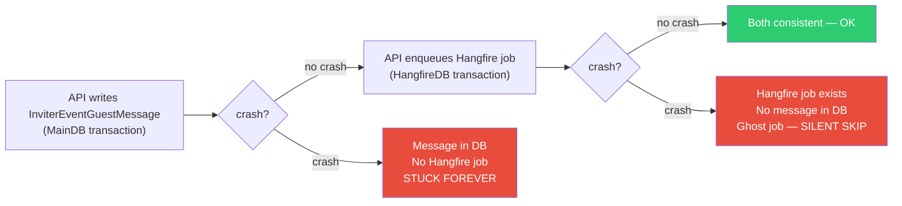

#### Internal Logic

**Write path (API):** `OutboxMessageJobScheduler.ScheduleMessageAsync()`:
1. Serializes payload to JSON
2. Creates `OutboxMessage` entity via `IRepository<OutboxMessage>.AddAsync()`
3. Returns `outboxEntry.Id.ToString()` as the tracking ID

Because `IRepository<OutboxMessage>` uses the same scoped `DbContext`, this write participates in the same `UnitOfWorkBehavior` transaction as the message record.

**Dispatch path (Workers):** `OutboxDispatcherService` runs as a `BackgroundService`:

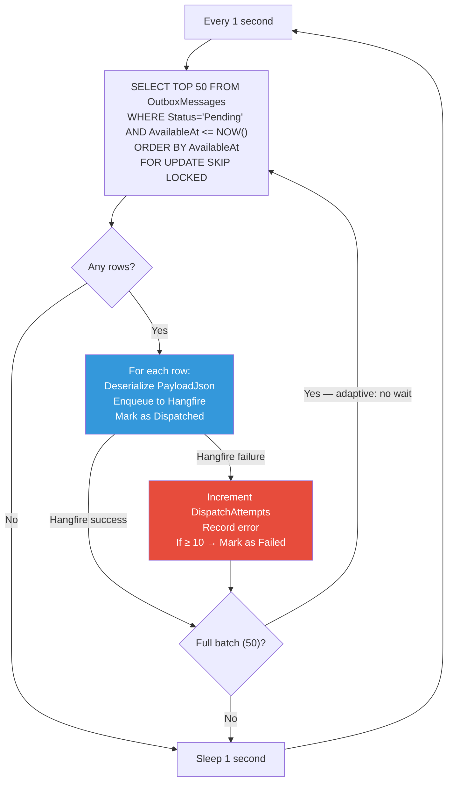

#### Dependencies
- `IBackgroundJobClient` (Hangfire) — for enqueuing to HangfireDB
- `IRepository<OutboxMessage>` / `DbContext` (MainDB) — for polling and status updates
- `FOR UPDATE SKIP LOCKED` — PostgreSQL-specific advisory locking for multi-pod safety

#### Inputs
Pending `OutboxMessage` rows in MainDB

#### Outputs
Hangfire jobs in HangfireDB; `OutboxMessage.Status = Dispatched`

#### State Management
`OutboxMessageStatus: Pending → Dispatched | Failed`

#### Failure Modes

| Failure | Behavior |
|---|---|
| Hangfire DB unreachable | `DispatchAttempts++`, retry next poll. After 10 failures → `Failed` |
| MainDB unreachable | `BackgroundService` exception logged; poll loop continues after delay |
| Pod crash during dispatch | Row still `Pending`; next pod picks it up (SKIP LOCKED prevents double-processing) |
| Hangfire enqueue succeeds, mark-dispatched fails | **Double dispatch risk** — the row stays `Pending` and gets re-enqueued. Twilio's idempotency key prevents the actual WhatsApp message from being sent twice. |

#### Retry Logic
10 dispatch attempts before marking `Failed`. Adaptive polling (no delay when batch is full).

#### Scaling Concerns
`FOR UPDATE SKIP LOCKED` naturally shards work across pods. Adding more worker pods increases dispatch throughput linearly (each pod claims its own batch).

#### Security Concerns
`PayloadJson` contains `MessageId`, `GuestId`, `OrganizationId` — no sensitive PII. Twilio credentials are NOT in the payload (resolved at delivery from the `Organization` entity).

#### Performance Considerations
The composite index on `(Status, AvailableAt)` makes the polling query a tight range scan. With high volume, the 50-row batch keeps each transaction short. The adaptive polling (no sleep when batch=50) prevents artificial throughput ceiling.

---

### 4.3 MessageOrchestrationService (API-side)

#### Responsibilities
**Lightweight orchestrator** on the API hot path. Its job is: validate the request, create a minimal message record, create an outbox entry — and nothing else. Deliberately avoids all expensive operations.

#### Internal Logic

`EnqueueMessageAsync(guestId, messageType)` — 12 logical steps:
1. Load guest + InviterEvent + Event + Organization (single tracking query)
2. Validate org exists + has Twilio credentials
3. Duplicate-pending check (`HasDuplicatePendingMessage`) — prevents sending two invitations to the same guest
4. Time-gate validation (Reminder before its scheduled time → reject; ThankYou before its scheduled time → reject)
5. Attended-guest filter (Reminder only to `Feedback == Attended`)
6. `InviterEventGuestMessage.Create(guestId, messageType)` — status = Pending, no template yet
7. `SetExpiration(eventDateTimeUtc)` — TTL stamp
8. `IRepository<InviterEventGuestMessage>.AddAsync(message)`
9. `IMessageJobScheduler.ScheduleMessageAsync(...)` → creates `OutboxMessage` (via `OutboxMessageJobScheduler`)
10. `message.MarkAsQueued(outboxId)` — status = Queued
11. `message.AddLog(Queued, "Job enqueued: {outboxId}")`
12. Return `Result.Success(messageId)` — `UnitOfWorkBehavior` commits everything atomically

`EnqueueBulkAsync` follows the same shape but:
- Batch-loads all guests in a single `WHERE g.Id IN (...)` query (N+1 prevention)
- Validates time gate once against the first guest's event
- Filters in-memory for Reminder (Attended guests only)
- Skips (with warning log) guests that already have a pending/queued message of the same type
- Uses `QueueNames.Bulk`

#### Design Decision: Template Resolution Deferred to Workers

The API does **not** resolve templates, parameters, or media URLs at enqueue time. Rationale:
- Keeps the API transaction short (no template DB joins on the hot path)
- Under bulk sends of 1,000 guests, loading template data per-guest in the API transaction would be prohibitively expensive
- Template data is immutable between enqueue and delivery (or if it changes, the Worker sees the latest version — which is correct behavior)
- Failure modes are simpler: if template resolution fails, it fails in the Worker where retry logic exists

#### Dependencies
- `IRepository<InviterEventGuest>` — guest loading
- `IMessageJobScheduler` → `OutboxMessageJobScheduler` — outbox writes
- `IRepository<InviterEventGuestMessage>` — message persistence

#### Failure Modes

| Failure | Response |
|---|---|
| Guest not found | `Result.Failure(NotFound)` → 404 |
| Organization has no Twilio credentials | `Result.Failure(OrganizationNotFound)` → 404 |
| Duplicate pending message | `Result.Failure(Conflict, DuplicateMessage)` → 409 |
| Time gate not open | `Result.Failure(Validation, ReminderTimeGate/ThanksTimeGate)` → 400 |
| Guest not confirmed (Reminder) | `Result.Failure(Validation, GuestNotAccepted)` → 400 |
| DB save failure | Exception propagates → `UnitOfWorkBehavior` rolls back entire transaction |

---

### 4.4 MessageDeliveryService (Worker-side)

#### Responsibilities
**Heavy lifter** — all expensive resolution and the actual Twilio API call. Executes inside the Worker process within a MediatR pipeline (full `LoggingBehavior → ValidationBehavior → UnitOfWorkBehavior`).

#### Internal Logic — `DeliverMessageAsync`

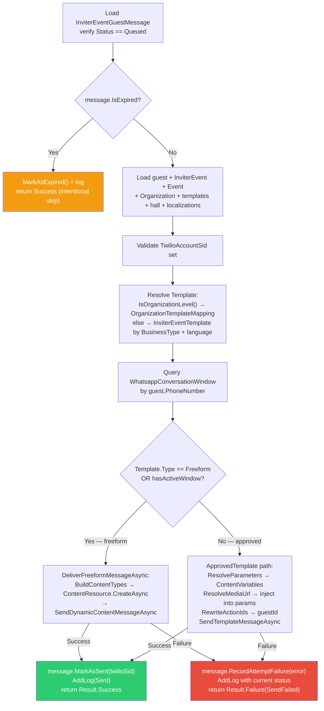

#### The Two Delivery Paths

| Condition | Path | Twilio API Used | Cost |
|---|---|---|---|
| `Template.Type == Freeform` OR `WhatsappConversationWindow.IsActive` | Dynamic freeform | `ContentResource.CreateAsync` → `MessageResource.CreateAsync` with new ContentSid | Session pricing (cheaper) |
| Outside 24h window AND `Template.TwilioContentSid` present | Approved template | `MessageResource.CreateAsync` with existing `ContentSid` + `ContentVariables` | Marketing/utility (per-message) |
| Outside 24h window AND no `TwilioContentSid` | **Hard failure** | None | N/A |

#### Dependencies
- `IRepository<InviterEventGuestMessage>` — message read + write (tracked)
- `IReadOnlyRepository<InviterEventGuest>` — guest context (no-tracking)
- `IReadOnlyRepository<WhatsappConversationWindow>` — window state (no-tracking)
- `ITwilioWhatsAppService` — Twilio integration
- `ITemplateParameterResolver` — `{{N}}` placeholder resolution
- `IAttachmentUrlService` — media URL resolution for Invitation/ThankYou
- `IConfigurationService` — S3 base URL for entrance cards

#### Failure Modes

| Failure | Action | Retryable? |
|---|---|---|
| Message not found | Return `NotFound` → `MessageProcessor` logs warning, no retry | No |
| Status != Queued | Return `Validation` error → log warning, no retry | No |
| Message expired | Return `Success` after `MarkAsExpired` — intentional skip | N/A |
| Template resolution fails | Return `Failure(TemplateNotFound)` → retry | Depends |
| Twilio non-success | `RecordAttemptFailure` + return `Failure(SendFailed)` → `PhasedRetry` | Yes |
| Twilio exception | Same as non-success | Yes |

---

### 4.5 WhatsAppRateLimiter

#### Responsibilities
Enforces a **per-pod token bucket rate limit** to ensure the combined Twilio call rate across all pods stays within Twilio's allowed rate, preventing `429 Too Many Requests` errors.

#### Internal Logic

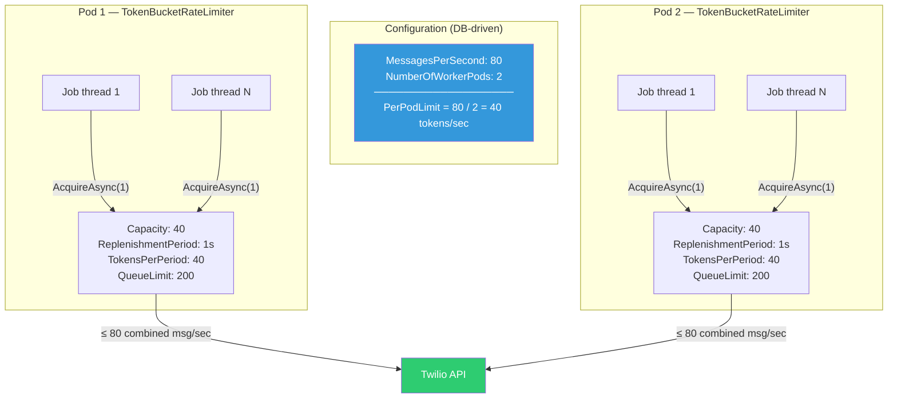

- Uses `System.Threading.RateLimiting.TokenBucketRateLimiter` (.NET 8 built-in)
- `QueueLimit: 200` — allows bursting up to 200 waiting requests before backpressure kicks in
- Lease held through entire Twilio API call (correct: token consumed for the duration, not just on entry)
- Registered as **singleton** — shared across all Hangfire worker threads within a pod

#### Failure Modes

| Failure | Behavior |
|---|---|
| Rate limit queue full (QueueLimit=200 exceeded) | `AcquireAsync` throws → Hangfire `PhasedRetry` reschedules the job |
| Config unavailable at startup | Falls back to 80 msg/sec default (single-pod assumption) |
| Scale-out without config update | **Critical gap** — each pod still thinks it's the only one; combined rate exceeds Twilio limit |

#### Scaling Concerns
Config-driven `NumberOfWorkerPods` must be updated manually before or during scale-out events. This is an **operational hazard** — see §15 for detailed risk analysis.

---

### 4.6 CircuitBreaker

#### Responsibilities
Prevents cascading failures when Twilio is degraded. Stops workers from hammering a failing external API, allows the system to accumulate retry-able jobs in Hangfire while the circuit is open, and gradually re-admits traffic once Twilio recovers.

#### State Machine

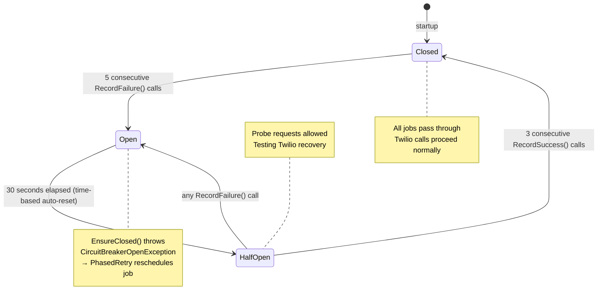

#### Internal Logic
Custom implementation using `lock` for thread safety. No external dependencies (no Polly, no Redis). Singleton in Workers.

#### Failure Modes

| Failure | Behavior |
|---|---|
| Twilio returns 5xx/timeout 5 times | Circuit opens; all jobs fail fast and queue up in Hangfire |
| Pod restart while circuit open | **Circuit resets to Closed** — no persistent state. Next 5 failures needed to re-open. |
| Half-open probe also fails | Circuit re-opens immediately (correct behavior) |

#### Known Gap: Non-Persistent State
Circuit breaker state is in-memory. A pod restart during a Twilio outage resets the breaker, potentially causing a brief surge of Twilio calls before the circuit opens again. In a multi-pod setup, pods may have different circuit states — no coordination between pods.

---

### 4.7 MessageProcessor (Unified Worker Processor)

#### Responsibilities
**Thin orchestration shell** in the Worker. Its only job is to gate Twilio access (circuit breaker + rate limiter) and route the result to Hangfire's retry machinery. All domain logic is delegated to `MessageDeliveryService` via MediatR.

#### Internal Logic

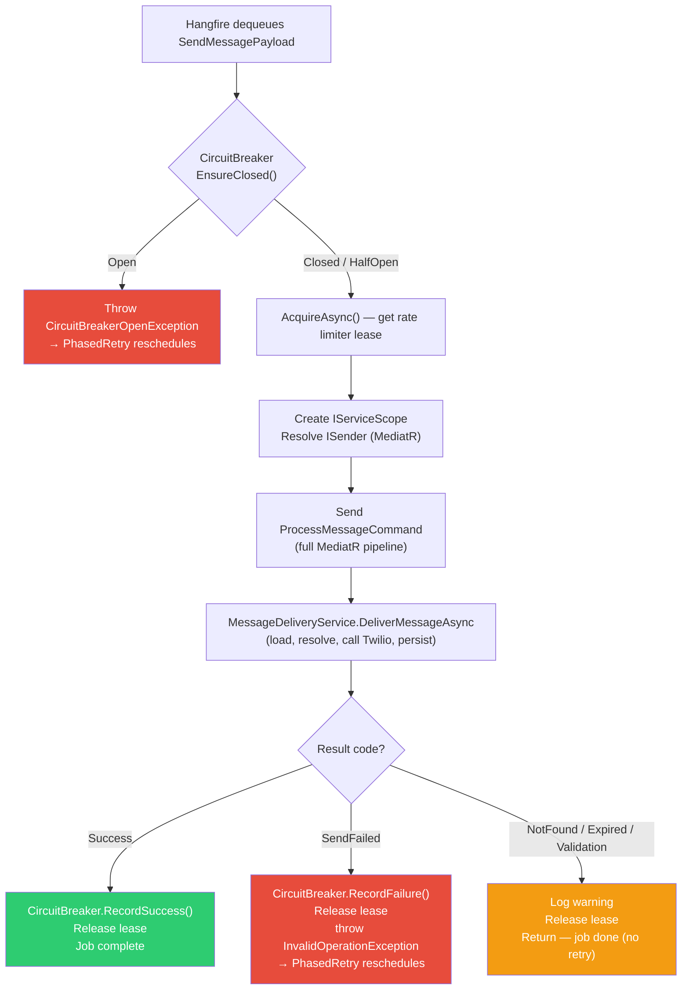

#### Key Design: Per-Job Service Scope
The processor creates a **new DI scope per job**, then resolves `ISender` (MediatR). This ensures:
- `IRepository<T>` (scoped) gets a fresh `DbContext` per job — no state leakage between jobs
- Domain events dispatched by `UnitOfWorkBehavior` fire within the correct scope
- Multiple concurrent jobs on the same pod each get isolated DB connections

---

### 4.8 WebhookProcessor

#### Responsibilities
Processes Twilio status webhooks asynchronously (after the API has already returned 200 OK). Updates message status, handles retry decisions, and maintains the audit log.

#### Internal Logic

1. Find `InviterEventGuestMessage` by `TwilioMessageSid`
2. Map Twilio status → `MessageStatus` via `TwilioStatusMapper`
3. *(Disabled today)* Apply forward-progress check
4. If `delivered/read` → update timestamp, add webhook log
5. If `undelivered/failed`:
   - Check permanent error codes (`21211, 21614, 21408, 63003, 63007, 63016`) → `MarkAsFailed`
   - Check `RetryCount >= 3` or `IsExpired` → `MarkAsFailed`
   - Otherwise (transient) → `RecordAttemptFailure` + new `OutboxMessage` with `AvailableAt = NOW + backoff(retryCount)` + `MarkAsQueued(newOutboxId)`

#### Failure Modes

| Failure | Behavior |
|---|---|
| Unknown `TwilioMessageSid` | Log warning, skip job silently |
| Duplicate webhook (same status) | **(Currently)** Accepted without forward-progress check — state may regress |
| DB failure during update | UnitOfWork rolls back; `PhasedRetry` reschedules the webhook job |

---

### 4.9 Recurring Background Jobs

| Job | Schedule | Purpose | Failure Handling |
|---|---|---|---|
| `OutboxDispatcherService` | Continuous (1s poll) | Dispatch pending outbox entries to Hangfire | 10 dispatch attempts per entry → Failed |
| `StuckMessageReconciliationJob` | Every 15 min | Re-enqueue messages stuck in Queued > 30 min | `PhasedRetry` on the reconciler job itself |
| `FailedMessageAlertJob` | Every 5 min | Send DLQ email digest for newly failed messages | `PhasedRetry` |
| `ExpiredMessageCleanupJob` | Every 10 min | Bulk-expire messages in Pending/Queued past their `ExpiresAt` | `PhasedRetry` |
| `ScheduledMessageSendJob` | Every hour (on the hour) | Auto-send Reminder/ThankYou when time gates open | `PhasedRetry` |
| `GenerateGuestEntranceCardJob` | Event-driven (domain event) | Render guest entrance card PNG → S3 | `PhasedRetry` |

---

## 5. Request Lifecycle

### 5.1 Single Message Send

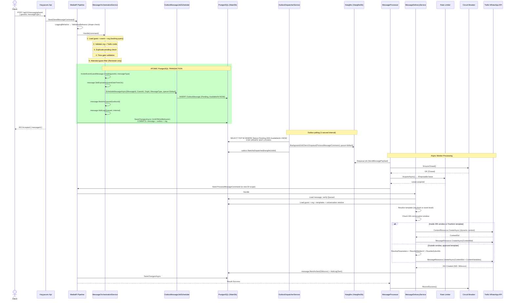

### 5.2 Webhook Processing

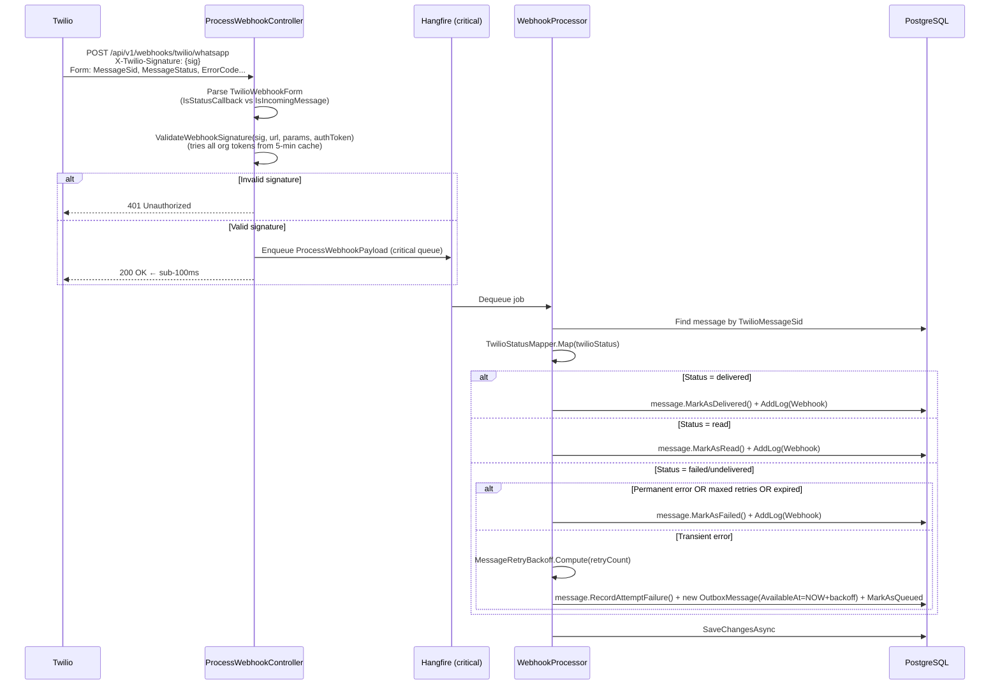

### 5.3 Bulk Send Flow

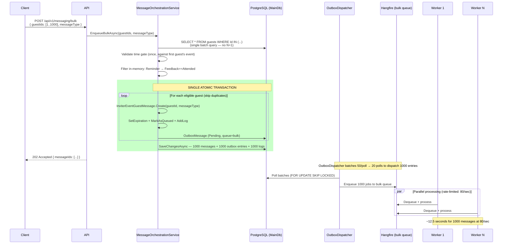

---

## 6. Event-Driven Architecture

### 6.1 Domain Events

Domain events are the primary **cross-slice communication mechanism**. They fire in-process after `SaveChangesAsync` via `ApplicationDbContext.DispatchDomainEventsAsync()`. They are **not** persisted — loss during a crash means the downstream handler doesn't run, and there is no automatic re-firing mechanism.

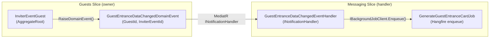

**Events raised from InviterEventGuest:**
- On QR code first assigned → `GuestEntranceDataChangedDomainEvent`
- On name / `TotalAdults` / `TotalChildren` update → `GuestEntranceDataChangedDomainEvent`
- On serial number assigned → `GuestEntranceDataChangedDomainEvent`

**Why cross-slice via events (not direct call):**
- Guests slice owns guest state; Messaging slice owns image generation
- Direct dependency would create a circular reference (or force unwanted coupling)
- Domain events allow loose coupling: the event handler is in Messaging, the aggregate is in Guests

### 6.2 Button Payload Event Flow (Inbound WhatsApp)

```mermaid
sequenceDiagram
    participant Guest as Guest (WhatsApp)
    participant Twilio
    participant API as ProcessWebhookController
    participant HF as Hangfire (critical)
    participant Proc as IncomingMessageProcessor
    participant Resolver as ButtonPayloadCommandResolver
    participant Window as OpenConversationWindowCommand
    participant DomainCmd as Domain Command<br/>(e.g., AcceptInvitation)

    Guest->>Twilio: Clicks "Accept" button (payload: ACCEPT_{guestId})
    Twilio->>API: POST /webhooks/twilio/whatsapp<br/>ButtonPayload=ACCEPT_{guestId}, SmsStatus=received
    API->>API: ParseGuestIdFromPayload() → guestId
    API->>HF: Enqueue ProcessIncomingMessagePayload<br/>(FromNumber, ButtonPayload, GuestId)
    API-->>Twilio: 200 OK

    HF->>Proc: Dequeue
    Proc->>Proc: GuestId already in payload (from controller parsing)
    Proc->>Window: OpenConversationWindowCommand(phoneNumber) [best-effort]
    Window->>DB: UPSERT WhatsappConversationWindow (Create or Refresh)
    Proc->>Resolver: Resolve("ACCEPT_3fa85f64-...", guestId)
    Resolver->>Resolver: Prefix scan (longest-first): "ACCEPT_" → AcceptInvitationCommand
    Resolver-->>Proc: AcceptInvitationCommand(guestId, payload)
    Proc->>MediatR: Send AcceptInvitationCommand
    MediatR->>MediatR: Full pipeline → AcceptInvitationCommandHandler
    Note over MediatR: Guest RSVP recorded; may trigger RsvpConfirmation message
```

### 6.3 Event Contracts & Ordering

| Concern | Current State |
|---|---|
| **Event ordering** | Domain events fire in the order raised within a single `SaveChangesAsync` call. No cross-request ordering guarantees. |
| **Idempotency** | `GenerateGuestEntranceCardJob` is idempotent (overwrites same S3 key). `OpenConversationWindowCommand` is upsert-idempotent. |
| **Deduplication** | Domain events have no dedup mechanism — duplicate events can occur if `SaveChangesAsync` retries internally. |
| **Eventual consistency** | The domain event → Hangfire job path is eventually consistent. If the event handler fails to enqueue, the entrance card is never generated. |

### 6.4 Webhook Event Topics

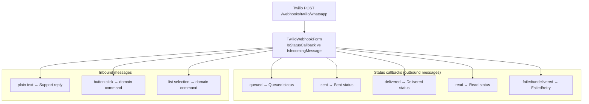

---

## 7. Data Layer Analysis

### 7.1 Database Architecture

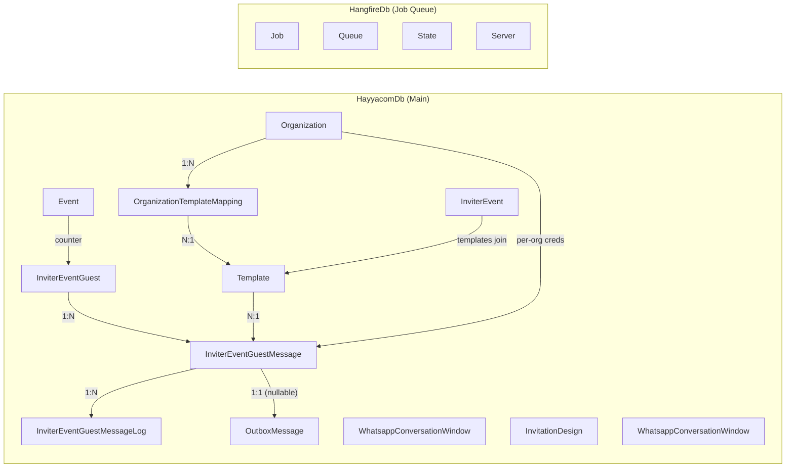

### 7.2 Entity Relationship Diagram

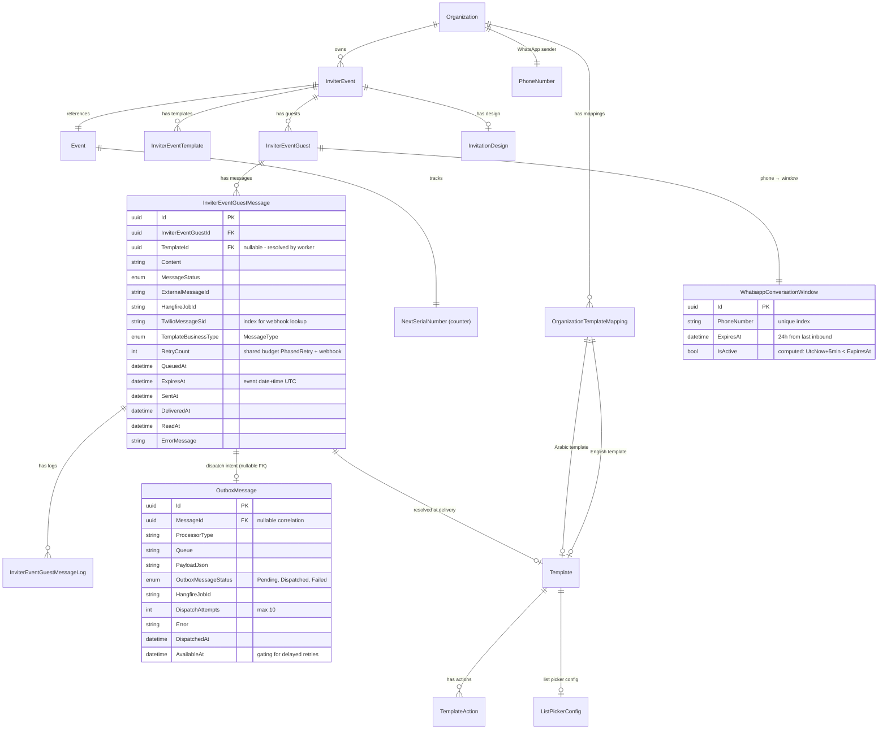

### 7.3 Indexing Strategy

| Table | Index | Purpose | Type |
|---|---|---|---|
| `OutboxMessage` | `(Status, AvailableAt)` | Gated polling query | Composite |
| `OutboxMessage` | `MessageId` | Correlation lookups | Single |
| `InviterEventGuestMessage` | `TwilioMessageSid` | Webhook lookup by SID | Single |
| `InviterEventGuestMessage` | `HangfireJobId` | Job tracking | Single |
| `InviterEventGuestMessage` | `QueuedAt` (implicit via query) | Stuck-message detection | Covered by scan |
| `WhatsappConversationWindow` | `PhoneNumber` | Unique — one window per number | Unique |
| `OrganizationTemplateMapping` | `(OrganizationId, TemplateType)` | One mapping per (org, type) | Unique |
| `OrganizationTemplateMapping` | `OrganizationId` | List queries | Single |

### 7.4 Storage Strategy

| Data Type | Storage | Rationale |
|---|---|---|
| Message records | PostgreSQL rows | ACID guarantees needed for status state machine |
| Outbox entries | PostgreSQL rows (same DB as messages) | Atomicity with message records is the entire point |
| Job queue state | Separate PostgreSQL DB (HangfireDB) | Isolation: HangfireDB failure doesn't block message creation |
| Entrance card images | Amazon S3 (deterministic key) | Binary blob, no DB-level joins needed, CDN-friendly |
| Template attachments | Amazon S3 (via `IAttachmentUrlService`) | Same pattern as images |
| Config values | `ConfigurationSettings` DB table | Hot-reload of rate limits, retry settings, webhook URL without redeploy |
| Twilio credentials | `Organization` entity (MainDB) | Per-tenant isolation; no shared secrets |

### 7.5 Consistency Model

| Operation | Consistency |
|---|---|
| Message creation + outbox entry | **Strong (single transaction)** |
| Outbox → Hangfire dispatch | **Eventual** (OutboxDispatcher is async) |
| Hangfire → Worker execution | **At-least-once** (Hangfire job delivery guarantee) |
| Webhook → status update | **Eventual** (webhook arrives after delivery) |
| Domain event → Hangfire job | **Eventual, best-effort** (in-process, no persistence) |

---

## 8. State Management

### 8.1 Message Status Lifecycle

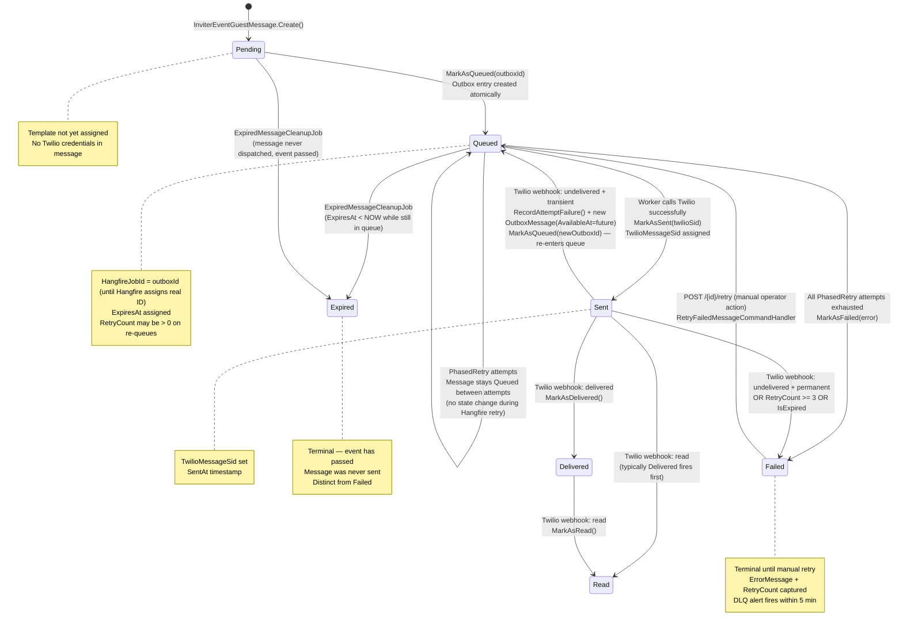

### 8.2 Outbox Status Lifecycle

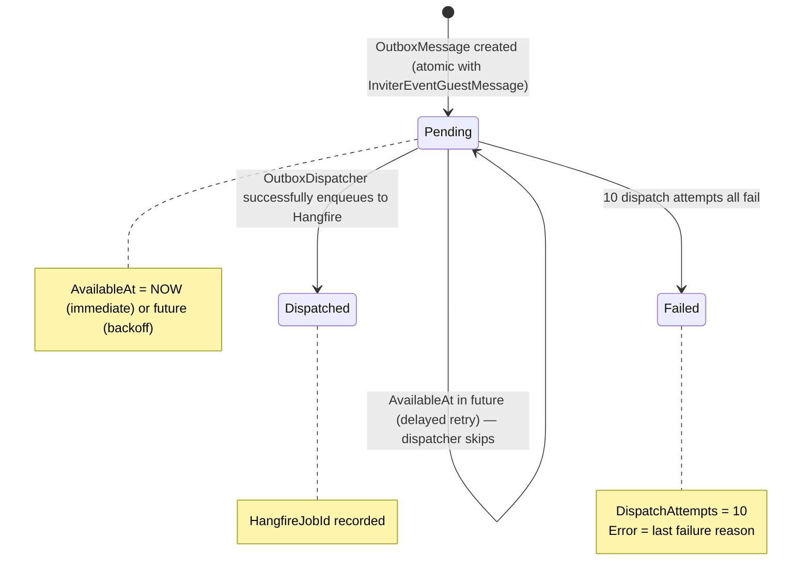

### 8.3 Circuit Breaker State

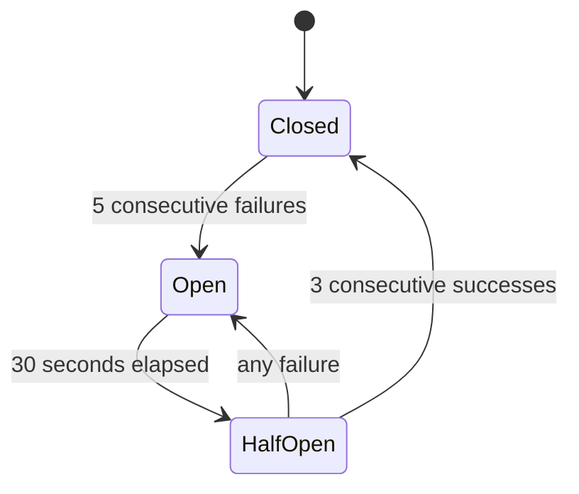

### 8.4 Race Conditions in State Management

| Scenario | Risk Level | Mitigation |
|---|---|---|
| Two API pods create messages for the same guest simultaneously | Medium | `HasDuplicatePendingMessage` check — but two concurrent creates can both pass the check before either commits | No UNIQUE constraint on `(GuestId, MessageType, Status IN (Pending,Queued))` |
| Multiple OutboxDispatcher pods dispatching the same entry | Low | `FOR UPDATE SKIP LOCKED` prevents this entirely |
| Webhook updates and PhasedRetry both mutate message concurrently | Low | Single-threaded per message (Hangfire runs one job per ID at a time). Webhook jobs are separate and operate on different state (`Sent` message won't have a PhasedRetry job running) |
| `StuckMessageReconciliationJob` races with an in-flight backoff retry | Medium | Check for `Pending OutboxMessage WHERE MessageId = m.Id` before re-enqueuing. If backoff outbox entry exists, skip. Window: the reconciler triggers at 30 min; max backoff is ~8 min — safe margin. |

---

## 9. Reliability & Fault Tolerance

### 9.1 Retry Topology

The system has two distinct retry paths that share a single `RetryCount` budget:

```mermaid
graph TB
    subgraph "Path 1: Synchronous Send Failure"
        P1_FAIL["Worker: Twilio API call fails<br/>MessageDeliveryService returns Failure(SendFailed)"]
        P1_THROW["MessageProcessor throws InvalidOperationException"]
        P1_PR["Hangfire PhasedRetryFilter intercepts"]
        P1_SCHED["Reschedule same job:<br/>Phase 1: 3 immediate retries<br/>Wait 5 min<br/>Phase 2: 3 immediate retries<br/>Wait 5 min<br/>Phase 3: 3 immediate retries"]
        P1_DEAD["Job marked FAILED<br/>message.MarkAsFailed()"]
    end

    subgraph "Path 2: Asynchronous Webhook Failure"
        P2_WH["Twilio async webhook: undelivered/failed<br/>after sync send succeeded"]
        P2_PROC["WebhookProcessor: ProcessWebhookStatusCommandHandler"]
        P2_PERM{"Permanent error OR<br/>RetryCount >= 3 OR IsExpired?"}
        P2_FAIL["message.MarkAsFailed()"]
        P2_BACKOFF["MessageRetryBackoff.Compute(retryCount)<br/>Full-jitter: delay ∈ [0, min(MaxDelay, 1min * 2^n)]"]
        P2_OUTBOX["Create new OutboxMessage(AvailableAt=NOW+backoff)<br/>message.MarkAsQueued(newOutboxId)"]
        P2_DISPATCH["OutboxDispatcher picks up after delay<br/>→ New Hangfire job → Full retry cycle"]
    end

    P1_FAIL --> P1_THROW --> P1_PR --> P1_SCHED
    P1_SCHED -->|"All phases exhausted"| P1_DEAD

    P2_WH --> P2_PROC --> P2_PERM
    P2_PERM -->|"Yes"| P2_FAIL
    P2_PERM -->|"No"| P2_BACKOFF --> P2_OUTBOX --> P2_DISPATCH
```

### 9.2 Failure Blast Radius Analysis

| Component Fails | Blast Radius | Recovery |
|---|---|---|
| **Twilio API down** | All sends fail; PhasedRetry queues up in Hangfire; circuit breaker opens after 5 failures. DLQ alerts fire after retry budget exhausted. | Circuit auto-recovers (HalfOpen after 30s). Backlogged Hangfire jobs drain when Twilio recovers. |
| **HangfireDB down** | New jobs cannot be enqueued; OutboxDispatcher enqueue fails (increments DispatchAttempts). Message records created but stuck in outbox. StuckMessageReconciliation will re-enqueue once Hangfire recovers. | HangfireDB recovery → OutboxDispatcher retries → jobs drain. |
| **MainDB down** | API: all requests fail. Workers: cannot update message status (UoW rolls back). Hangfire retries the job. | DB recovery → in-flight jobs complete. |
| **Worker pod crash** | In-flight Hangfire jobs (partially processed) get picked up by other pods or by the same pod after restart. Hangfire's visibility timeout handles this. Entrance card generation domain events lost (see §15). | Hangfire auto-recovery. StuckMessageReconciliation re-enqueues stuck Queued messages. |
| **API pod crash** | In-flight HTTP requests fail; clients receive 5xx. Outbox entries already committed are safe. | ALB routes to healthy pods. |
| **S3 unavailable** | Entrance card generation fails (PhasedRetry applies). Twilio media fetch fails for entrance card messages (message sends fail). | PhasedRetry on entrance card generation. Media fetch failure surfaces as `undelivered` webhook → retry path. |

### 9.3 Dead Letter Queue

Messages that exhaust all retries land in `Failed` status. The DLQ system:

```mermaid
flowchart LR
    FAIL["message.Status = Failed<br/>(RetryCount exhausted)"]
    ALERT["FailedMessageAlertJob (every 5 min)<br/>Finds Failed messages without 'DLQ alert sent' log"]
    EMAIL["Send digest email to Messaging:DlqAlertEmails"]
    LOG["Add InviterEventGuestMessageLog<br/>(Source=Internal, Details='DLQ alert sent')"]
    QUERY["GraphQL: failedMessages(filters)"]
    RETRY["POST /api/v1/messaging/{id}/retry"]
    REQUEUE["RetryFailedMessageCommandHandler:<br/>Reuse historical outbox payload<br/>New OutboxMessage (AvailableAt=NOW)<br/>message.MarkAsQueued (RetryCount preserved)"]

    FAIL --> ALERT
    ALERT --> EMAIL
    ALERT --> LOG
    LOG -.->|"prevents duplicate alerts"| ALERT
    QUERY -->|"operator discovery"| RETRY
    RETRY --> REQUEUE
```

### 9.4 The TTL / Expiry Safety Net

```mermaid
flowchart LR
    CREATE["Message created<br/>ExpiresAt = Event.Date + Event.Time (UTC)"]
    A{"At delivery time<br/>(MessageDeliveryService):<br/>IsExpired?"}
    SKIP_DELIVERY["MarkAsExpired() + log<br/>return Success — no Twilio call<br/>No credit wasted"]
    B{"ExpiredMessageCleanupJob<br/>(every 10 min):<br/>Pending/Queued AND ExpiresAt < NOW?"}
    BULK_EXPIRE["Bulk MarkAsExpired()<br/>Prevents stale messages sitting in queue"]

    CREATE --> A & B
    A -->|"Yes"| SKIP_DELIVERY
    B -->|"Yes"| BULK_EXPIRE
```

---

## 10. Concurrency Analysis

### 10.1 Database-Level Concurrency

#### `FOR UPDATE SKIP LOCKED` — Outbox Dispatcher

This is the most important concurrency control in the system. When multiple `OutboxDispatcherService` pods poll simultaneously:

```mermaid
sequenceDiagram
    participant Pod1 as OutboxDispatcher Pod 1
    participant Pod2 as OutboxDispatcher Pod 2
    participant DB as PostgreSQL

    par Pod 1 transaction
        Pod1->>DB: BEGIN
        Pod1->>DB: SELECT TOP 50 WHERE Status=Pending AND AvailableAt<=NOW<br/>FOR UPDATE SKIP LOCKED<br/>→ locks rows 1-50
        Note over Pod1,DB: Pod 1 holds locks on rows 1-50
    and Pod 2 transaction
        Pod2->>DB: BEGIN
        Pod2->>DB: SELECT TOP 50 WHERE Status=Pending AND AvailableAt<=NOW<br/>FOR UPDATE SKIP LOCKED<br/>→ rows 1-50 locked, SKIP them<br/>→ locks rows 51-100
        Note over Pod2,DB: Pod 2 holds locks on rows 51-100
    end

    Pod1->>DB: Mark rows 1-50 as Dispatched + COMMIT
    Pod2->>DB: Mark rows 51-100 as Dispatched + COMMIT
```

**Properties:**
- No duplicate dispatch — `SKIP LOCKED` is non-blocking and correct
- No deadlocks — each pod takes a fresh batch, no lock contention
- Throughput scales linearly with pods (each pod processes 50/sec independently)

#### Dual-Create Race (Duplicate Message)

The `HasDuplicatePendingMessage` check is **optimistic** — it reads before the transaction commits:

```mermaid
sequenceDiagram
    participant Req1 as API Request 1
    participant Req2 as API Request 2
    participant DB

    Req1->>DB: SELECT: any Pending/Queued message for guestId+messageType? → No
    Req2->>DB: SELECT: any Pending/Queued message for guestId+messageType? → No
    Note over Req1,Req2: Both pass the duplicate check!
    Req1->>DB: INSERT InviterEventGuestMessage (Pending) + OutboxMessage
    Req2->>DB: INSERT InviterEventGuestMessage (Pending) + OutboxMessage
    Note over DB: Two messages exist — DUPLICATE
```

**Risk level:** Low in practice (the same guest rarely triggers simultaneous send requests), but the guarantee is not strong. There is no database-level UNIQUE constraint on `(InviterEventGuestId, MessageType, Status IN ('Pending','Queued'))`.

### 10.2 Serial Number Allocation Race

```mermaid
sequenceDiagram
    participant R1 as Bulk Create Request 1
    participant R2 as Bulk Create Request 2
    participant DB

    R1->>DB: SELECT Event (NextSerialNumber = 100)
    R2->>DB: SELECT Event (NextSerialNumber = 100)
    R1->>R1: AllocateSerialNumber() → 100, sets NextSerialNumber = 101
    R2->>R2: AllocateSerialNumber() → 100, sets NextSerialNumber = 101
    R1->>DB: SaveChanges — NextSerialNumber = 101
    R2->>DB: SaveChanges — NextSerialNumber = 101 (overwrites R1!)
    Note over DB: TWO GUESTS GET SERIAL 100
```

**Risk level:** Low for single-organizer workflows; medium if multiple operators trigger concurrent bulk creates on the same event. The fix (PostgreSQL sequence or `SELECT ... FOR UPDATE`) is not implemented.

### 10.3 Webhook Forward-Progress Check (Disabled)

```mermaid
stateDiagram-v2
    Sent --> Delivered: correct webhook
    Delivered --> Sent: REGRESSION (currently allowed)
    Delivered --> Read: correct webhook
    Read --> Delivered: REGRESSION (currently allowed)
```

**Risk:** Out-of-order or duplicate Twilio webhooks can temporarily regress a message's status. Twilio occasionally retries webhooks on transient failures; without the `IsForwardProgress` check, a late re-delivery of an older status overwrites a newer one. The design correctly identified this risk and built `TwilioStatusMapper.IsForwardProgress()` — but the call site is commented out.

### 10.4 Hangfire Single-Execution Guarantee

Hangfire guarantees **at-most-one concurrent execution** of a specific job ID. This means:
- A Queued message can have at most one active `MessageProcessor` run at a time
- PhasedRetry reschedules the *same job ID* — no concurrent retries
- This prevents two workers from calling Twilio with the same `messageId` idempotency key simultaneously (which would be safe anyway, but this adds a second layer)

---

## 11. Scalability Analysis

### 11.1 Throughput Model

```mermaid
graph LR
    subgraph "API Tier"
        API_RPS["API: stateless, horizontal<br/>Target: 1000+ msg/min enqueue<br/>~17/sec commit rate"]
    end

    subgraph "OutboxDispatcher"
        OBD["50 entries/poll × N pods<br/>1-second polling cycle<br/>Max dispatch: 50N entries/sec"]
    end

    subgraph "Hangfire Workers (per pod)"
        HF_W["WorkerCount: 20 threads/pod<br/>Rate-limited: 40/sec (at 2 pods, 80 global)"]
    end

    subgraph "Twilio"
        TWL["80 msg/sec global rate<br/>~4,800 msg/min<br/>~288,000 msg/hr"]
    end

    API_RPS -->|"outbox entries"| OBD
    OBD -->|"Hangfire jobs"| HF_W
    HF_W -->|"API calls"| TWL
```

**Throughput ceiling:** Twilio's 80 msg/sec rate limit (configurable) is the primary bottleneck. At 80/sec, sending to 1,000 guests takes ~12.5 seconds. This is well within the "1000+ messages/minute" target.

### 11.2 Scaling Dimensions

| Dimension | Scale-Out Mechanism | Bottleneck | Config Coordination Needed |
|---|---|---|---|
| **API** | Add API containers (stateless) | DB connection pool | No |
| **OutboxDispatcher** | Add Worker pods (SKIP LOCKED handles it) | DB connection pool on polling | No |
| **Hangfire worker threads** | Increase `WorkerCount` per pod | Twilio rate limit | Yes — must adjust `NumberOfWorkerPods` |
| **Twilio throughput** | Add Worker pods | Twilio account limits | **Yes — critical: must update `NumberOfWorkerPods`** |
| **Database** | RDS vertical scaling / read replicas | Write throughput | Application changes needed for replica usage |

### 11.3 Bulk Send Bottlenecks

For a 1,000-guest bulk send:

1. **API transaction size:** 1,000 `InviterEventGuestMessage` rows + 1,000 `OutboxMessage` rows + 1,000 `InviterEventGuestMessageLog` rows = **3,000 rows in one transaction.** At ~100 bytes per row, this is ~300KB of data in a single commit. PostgreSQL handles this fine, but the transaction holds locks for the duration of all inserts.

2. **Outbox dispatch latency:** 1,000 entries at 50/poll = 20 polls. With 1s sleep between polls (non-full-batch assumed after the bulk), dispatching takes up to 20 seconds. With adaptive polling (full batch → no sleep), it's closer to seconds.

3. **Memory pressure:** `EnqueueBulkAsync` loads all 1,000 guests + their events + org in memory simultaneously. For very large events (10,000+ guests), this could be a GC pressure issue.

### 11.4 Database Pressure

| Source | DB Load |
|---|---|
| Outbox polling (1s interval, 2 pods) | 2 `SELECT ... FOR UPDATE SKIP LOCKED` queries/sec constantly |
| Bulk send (1,000 guests) | 3,000 row inserts in one transaction; brief lock hold |
| Worker status updates (80/sec) | 80 UPDATEs/sec on `InviterEventGuestMessage` + 80 INSERTs on log table |
| Webhook processing | ~80 SELECT by `TwilioMessageSid` + UPDATE per webhook |
| Reconciliation job | Full table scan on stuck messages every 15 min |
| Expiry cleanup | Index range scan on (Status, ExpiresAt) every 10 min |

**Estimated sustained DB write rate at 80 msg/sec:** ~240 writes/sec (status update + log + potentially a new OutboxMessage for webhook retries). PostgreSQL on modern RDS instances handles this comfortably.

---

## 12. Security Analysis

### 12.1 Trust Boundary Diagram

```mermaid
graph TB
    subgraph "Trusted Zone (Internal)"
        API["Hayyacom.Api<br/>[Authenticated, Authorized]"]
        WORKERS["Hayyacom.Workers<br/>[Internal only, no public exposure]"]
        MAINDB["PostgreSQL MainDB<br/>[VPC private subnet]"]
        HFDB["PostgreSQL HangfireDB<br/>[VPC private subnet]"]
    end

    subgraph "Partially Trusted (Webhook)"
        TWILIO_WH["Twilio Webhooks<br/>[HMAC-SHA1 signature validated]"]
    end

    subgraph "Public Internet (Untrusted)"
        MOB["Mobile / Web Clients<br/>[JWT authenticated]"]
        INTERNET["Internet"]
    end

    subgraph "External Service (Trusted TLS)"
        TWILIO_API["Twilio WhatsApp API<br/>[TLS + per-org credentials]"]
        S3["Amazon S3<br/>[IAM role authentication]"]
    end

    MOB -->|"JWT bearer token"| API
    INTERNET -->|"⚠ [AllowAnonymous] webhook endpoint"| API
    API -->|"validates X-Twilio-Signature"| TWILIO_WH
    TWILIO_WH -->|"accepted"| WORKERS
    WORKERS -->|"per-org AccountSid+AuthToken"| TWILIO_API
    WORKERS -->|"IAM role"| S3
    API & WORKERS -->|"connection strings"| MAINDB & HFDB

    style TWILIO_WH fill:#f39c12,color:#fff
    style INTERNET fill:#e74c3c,color:#fff
    style API fill:#3498db,color:#fff
    style WORKERS fill:#e67e22,color:#fff
```

### 12.2 Authentication & Authorization

| Surface | Auth Mechanism | Notes |
|---|---|---|
| REST commands | JWT bearer token | Standard — not detailed in engine docs |
| GraphQL queries | JWT bearer token | Standard |
| Webhook endpoint | `[AllowAnonymous]` + HMAC-SHA1 signature validation | Correct pattern. Signature validation is the only gatekeeping. |
| Hangfire dashboard | API-level auth (development: open) | **MUST be locked in production** |
| Worker health endpoints (8081) | None (internal-only port, no public exposure) | Kubernetes NetworkPolicy should restrict |

### 12.3 Twilio Credential Management

**Multi-tenant credential isolation:** Each `Organization` stores its own `TwilioAccountSid` and `TwilioAuthToken`. No shared credentials. `TwilioWhatsAppService` creates a per-org `TwilioRestClient` for every call.

**Risks:**
- Credentials stored as **plaintext strings in the database**. Should be encrypted at rest (column-level encryption or stored in a secrets manager with only references in the DB).
- `TwilioAuthToken` is used for webhook signature validation — it's loaded into memory and cached for 5 minutes. A memory dump during this window exposes the token.
- No credential rotation mechanism is described. Rotation would require updating `Organization` rows and restarting the signature-validation cache.

### 12.4 Webhook Security

**Correct implementation:**
- Signature validated before any processing
- Production: missing/invalid signature returns 401
- Development-only bypass (environment-gated)
- Canonical webhook URL loaded from DB config (not from `Request.Host`) to prevent header injection by a reverse proxy

**Risks:**
- Signature validation iterates over all org auth tokens. If an attacker can craft a payload that validates against one org's token, they could inject a webhook status update for any message. The message is looked up by `TwilioMessageSid` — but only Twilio knows real SIDs, so this risk is low in practice.
- The cached token list (5 min) means a revoked credential takes up to 5 minutes to stop being accepted.

### 12.5 Payload Security

`SendMessagePayload` contains `(MessageId, GuestId, OrganizationId, MessageType)` — no PII. The guest's phone number is NOT in the payload; it's resolved from the DB at delivery time. This is a good design: if the Hangfire DB were compromised, an attacker would get job IDs and GUIDs, not phone numbers.

`ProcessWebhookPayload` contains `RawBody` (full Twilio form payload). This may include phone numbers. Hangfire encrypts job data at rest only if configured — if not, this is plaintext in the HangfireDB.

### 12.6 Button Payload Injection

`ButtonPayloadCommandResolver` matches button payloads to commands by prefix. An attacker who can control the button payload string could potentially invoke arbitrary registered commands. However:
- Payloads come from Twilio webhooks, which are signature-validated
- Commands require a valid `guestId` parsed from the payload
- The resolver only matches `[ButtonPayload]`-decorated command types

Risk level: **Low** — requires Twilio webhook compromise (very high bar) or an incorrect `[ButtonPayload]` prefix registration.

### 12.7 Data Exposure

| Data | Exposure Risk |
|---|---|
| Guest phone numbers | Stored in MainDB; not in Hangfire payloads. Risk: DB breach. |
| Twilio credentials | Stored in `Organization` table. Risk: DB breach exposes all org credentials. |
| `RawBody` in webhook payloads | Stored in Hangfire DB. May contain phone numbers. |
| Entrance card PNGs | Stored in S3 public (for Twilio media fetch). Guest QR codes are publicly accessible via deterministic URL. |
| Message content / template params | Stored in `InviterEventGuestMessageLog.Details`. Audit trail = data exposure if logs compromised. |

---

## 13. Performance Analysis

### 13.1 Latency Sources

```mermaid
graph LR
    subgraph "API Hot Path (target: < 200ms)"
        DB1["DB read: guest + event + org (~20ms)"]
        VALID["Validation + business rules (~1ms)"]
        DB2["DB write: message + outbox + log (~15ms)"]
        RESP["HTTP response (~1ms)"]
    end

    subgraph "Outbox Dispatch Latency (target: < 2s)"
        POLL["Poll every 1s — worst case 1s wait"]
        HF_ENQ["Hangfire enqueue (~10ms)"]
    end

    subgraph "Worker Processing Latency (target: < 5s per message)"
        RL_WAIT["Rate limiter wait (variable, depends on queue depth)"]
        DB_LOAD["Load message + context (~30ms)"]
        TWILIO["Twilio API call (~200-500ms typical)"]
        DB_UPD["Status update (~15ms)"]
    end

    DB1 --> VALID --> DB2 --> RESP
    POLL --> HF_ENQ
    RL_WAIT --> DB_LOAD --> TWILIO --> DB_UPD
```

**End-to-end latency (single message):** API commit (~50ms) + outbox dispatch (<1s) + Worker processing (~500-800ms) = **~1.5-2 seconds from API request to WhatsApp send.**

### 13.2 Hot Path Analysis

**Bulk send (1,000 guests) — critical path:**
1. `WHERE Id IN (...)` batch load: ~50-100ms for 1,000 guests with joins
2. In-memory loop to create 1,000 entities + 1,000 outbox entries: ~5ms
3. `SaveChangesAsync` with 3,000 rows: **~200-500ms** (this is the expensive step)
4. Total API response time for bulk: **~300-700ms** — acceptable for 202 Accepted

### 13.3 Expensive Operations

| Operation | Cost | Frequency | Optimization Potential |
|---|---|---|---|
| Bulk insert (3,000 rows) | High (500ms+) | Low (once per bulk send) | Batched inserts with EF Core `AddRangeAsync` are already used |
| `ContentResource.CreateAsync` (freeform path) | High (~300ms extra Twilio call) | Every freeform message | None — Twilio API requirement |
| SkiaSharp entrance card render | Very High (CPU + memory) | Per guest, per data change | Already pre-generated; only regenerated on changes |
| `FOR UPDATE SKIP LOCKED` polling | Low (~5ms) | Every 1 second | Acceptable; adaptive batching when load is high |
| Template parameter resolution | Low (~1ms, in-memory) | Every message delivery | No optimization needed |

### 13.4 Memory Considerations

- **Bulk load:** Loading 1,000 guests with joins into memory is ~10-50MB depending on data size. EF Core change tracking for 3,000 entities adds overhead. The `SaveChangesAsync` flushes them all.
- **Entrance card generation:** `SKBitmap.Decode` + `SKSurface.Create` for full-resolution design images could be 10-100MB per job depending on image dimensions. Workers handle this synchronously within the job — no streaming to S3.
- **Rate limiter queue:** `QueueLimit: 200` means up to 200 Hangfire threads can be blocked waiting for a token. Each blocked thread holds a stack frame but no large allocations.

### 13.5 Performance Optimizations in Place

| Optimization | Where |
|---|---|
| Batch load (no N+1) | `EnqueueBulkAsync` — single `WHERE IN` query |
| Template resolution deferred | API path is lightweight; heavy work in Workers |
| Adaptive outbox polling | No sleep when full batch — saturates dispatch throughput |
| Token bucket (not semaphore) | Smooth rate limiting, no thundering herd |
| Full-jitter backoff | Spreads webhook retries to prevent synchronized retry storms |
| Deterministic S3 keys | No orphan detection needed; overwrite is idempotent |
| `IReadOnlyRepository` for queries | No-tracking EF queries for GraphQL reads |
| `FOR UPDATE SKIP LOCKED` | Non-blocking multi-pod dispatch |

---

## 14. Operational Concerns

### 14.1 Deployment

| Concern | Design | Gap |
|---|---|---|
| **Zero-downtime deploys** | Rolling deploy (ECS/K8s rollout). In-flight Hangfire jobs finish before pod terminates (ShutdownTimeout: 2min). | If deploy takes > 2 min, jobs may be abandoned mid-flight. |
| **Config hot-reload** | Rate limits, retry settings, webhook URL loaded from DB (`ConfigurationSettings` table). Changes take effect without redeploy (up to 15-min cache TTL). | Twilio credentials require entity update + cache expiry. |
| **Multi-environment** | K8s overlays (staging, preprod, prod) with Kustomize + ExternalSecret. | — |
| **Both containers trigger on `backend/**` changes** | `deploy-backend.yml` + `deploy-workers.yml` both trigger on `backend/**`. | A backend code change deploys both containers — correct but means Workers is always in sync with API project. |

### 14.2 Health Checks

| Endpoint | URL | Checks | K8s Probe |
|---|---|---|---|
| Liveness | `GET /health/live` (port 8081) | None — always 200 if process alive | `livenessProbe` |
| Readiness | `GET /health/ready` (port 8081) | DB connectivity + circuit breaker state | `readinessProbe` |

When circuit breaker is Open → Readiness returns Degraded. This correctly prevents the load balancer from routing new jobs to a pod that's struggling with Twilio failures. However, since Workers don't receive HTTP traffic (only process Hangfire jobs), readiness doesn't affect traffic routing in practice — but it does affect K8s autoscaling decisions.

### 14.3 Monitoring & Observability

**Logging:** Serilog structured logging with Console + File sinks. All handlers log via `LoggingBehavior` (request/response + execution time).

**Tracing:** No distributed tracing (OpenTelemetry/Jaeger) is described. Given the async nature (API → Outbox → Hangfire → Worker), correlating a message send to its delivery requires the `MessageId` as a correlation key. Without distributed tracing, this correlation must be done manually via log queries.

**Metrics:** No metrics system (Prometheus/CloudWatch custom metrics) is described. Operators must query the DB for statistics (counts by status, error rates, etc.).

**Alerting:** DLQ alert email (5-min polling) is the only automated alert. No integration with PagerDuty, OpsGenie, CloudWatch alarms, or Slack for:
- Circuit breaker open events
- OutboxDispatcher failure spikes
- Hangfire queue depth thresholds
- Database connectivity issues

### 14.4 Operational Runbook Requirements (Missing)

The following operational procedures should exist but are only mentioned as "document this in the runbook" without the actual runbook content:

1. **Scale Workers up/down:** Must update `WhatsApp:NumberOfWorkerPods` in `ConfigurationSettings` table before adding/removing Worker pods.
2. **Manual DLQ retry:** `POST /api/v1/messaging/{id}/retry` — no bulk retry mechanism for mass failure events.
3. **Twilio credential rotation:** Update `Organization.TwilioAuthToken` → clear signature validation cache (or wait 5 min).
4. **Emergency circuit breaker reset:** No manual override for the circuit breaker state. Must restart the pod.
5. **Disaster recovery:** No described procedure for MainDB point-in-time recovery with Hangfire state reconciliation.

---

## 15. Weaknesses & Risks

### 15.1 Critical: Forward-Progress Check Disabled

**Description:** `TwilioStatusMapper.IsForwardProgress()` exists but the call site in `ProcessWebhookStatusCommandHandler` is explicitly commented out.

**Risk:** Twilio retries webhooks on failures (15s timeout). If the webhook processor was slow and Twilio retried, the second webhook could arrive after the first was processed. Without forward-progress filtering:
- A `delivered` message receiving a late `sent` webhook regresses to `Sent`
- A `read` message receiving a late `delivered` webhook regresses to `Delivered`
- A `failed` retry path could be re-triggered incorrectly

**Blast radius:** All messages at risk. During Twilio retry storms (e.g., brief outage causes many webhooks to be retried), status regressions could affect many messages simultaneously.

**Fix:** Uncomment the `IsForwardProgress` check and add a database-level UNIQUE constraint or optimistic concurrency check to prevent concurrent webhook processors from racing on the same message.

---

### 15.2 High: Rate Limiter Requires Manual Config Sync with Scale-Out

**Description:** `WhatsAppRateLimiter` reads `WhatsApp:NumberOfWorkerPods` from DB config **at startup**. Each pod divides the global rate by this number.

**Scenario:** 1 pod running (config: 80/sec, 1 pod → 80/sec per pod). Operator scales to 3 pods without updating the config. Result: **3 pods × 80/sec = 240 calls/sec to Twilio**, 3x over the limit. Twilio returns 429, triggering PhasedRetry storms.

**Blast radius:** Mass delivery failures, retry queue explosion, potential Twilio account rate-limiting or suspension.

**Fix:** Implement a distributed rate limiter using Redis (Sliding Window or Token Bucket via Redis). All pods share a single rate limit without config coordination. Alternatively, use AWS API Gateway throttling as the rate-limiting layer.

---

### 15.3 High: In-Memory Circuit Breaker Per Pod

**Description:** Each Worker pod has its own independent circuit breaker state. If Pod 1 has seen 4 failures and Pod 2 has seen 1, Pod 1 will trip (Open) while Pod 2 continues sending.

**Risk 1:** Partial protection — a degraded Twilio still receives traffic from pods with fewer failure counts.

**Risk 2:** Pod restart resets the circuit breaker to Closed, causing a surge of requests immediately after restart during a Twilio outage.

**Fix:** Use a shared circuit breaker state in Redis. Polly's `CircuitBreakerPolicy` with Redis-backed state store. Or, implement the circuit breaker at the Twilio API Gateway level (if using one).

---

### 15.4 High: Workers → Api Project Reference (Tight Coupling)

**Description:** `Hayyacom.Workers` references `Hayyacom.Api` as a project dependency. This means Workers compiles and deploys with ALL API-layer code: GraphQL types, REST controllers, HotChocolate registrations, API-specific services.

**Risks:**
- Workers binary is larger than necessary (includes ~50% irrelevant code)
- A change to an API-only concern (GraphQL schema, REST routing) can break the Workers build
- Cannot independently version API and Workers
- Docker image for Workers includes packages (HotChocolate, Swashbuckle) that should never execute in a worker process

**Fix:** Extract shared domain model into a separate `Hayyacom.Domain` project. Both Api and Workers reference the domain library. Workers references only domain entities, services, and infrastructure (EF Core, Twilio wrapper). This was explicitly planned ("refactor later if needed").

---

### 15.5 Medium: Serial Number Allocation Race Condition

**Description:** `Event.NextSerialNumber` increment uses standard EF Core change tracking — no explicit `SELECT ... FOR UPDATE` or PostgreSQL sequence. Under concurrent bulk guest creation on the same event, two requests can read the same `NextSerialNumber` and produce duplicate serial numbers.

**Risk:** Two guests at the same event receive the same serial number → same QR code → the venue entrance scanner cannot distinguish them → operational chaos at check-in.

**Fix:** Use a PostgreSQL sequence per event (e.g., `event_{id}_serial_seq`) or a `SELECT ... FOR UPDATE NOWAIT` on the `Event` row during serial number allocation.

---

### 15.6 Medium: Domain Event Loss on Pod Crash

**Description:** Domain events (`GuestEntranceDataChangedDomainEvent`) are dispatched in-process after `SaveChangesAsync`. If the pod crashes between commit and event dispatch, or if the event handler throws, the entrance card generation job is never enqueued.

**Impact:** Guest's entrance card image is never generated. When the `Entrance` message is sent, the URL is constructed deterministically but the file doesn't exist on S3. Twilio fails to fetch the media → `undelivered` webhook → retry path → eventually `Failed`.

**Fix (pragmatic):** Add a `CardGeneratedAt` timestamp to `InviterEventGuest`. The `GenerateGuestEntranceCardJob` sets it on success. `MessageDeliveryService.ResolveEntranceCardUrl` does a HEAD request or checks `CardGeneratedAt` before constructing the URL. If not ready, return `Failure` and let PhasedRetry handle it.

**Fix (structural):** Use a Transactional Outbox for domain events as well (store `DomainEvent` records in the DB atomically; dispatch via `BackgroundService`).

---

### 15.7 Medium: Entrance Card URL — No Existence Verification

**Description:** `MessageDeliveryService.ResolveEntranceCardUrl` constructs the S3 URL by string concatenation only. No HEAD request, no existence check, no `CardGeneratedAt` flag.

**Impact:** If the entrance card rendering job failed (or hasn't run yet), the Twilio message references a non-existent S3 object. Twilio fetches the media, gets 404, marks the message as `undelivered`. This triggers the webhook retry path, consuming the retry budget. If the rendering job never succeeds, the entrance card message permanently fails.

**Risk:** Silently sends Twilio a broken media URL. The failure is only visible after the fact via the `undelivered` webhook.

---

### 15.8 Medium: No Bulk DLQ Retry

**Description:** The manual retry endpoint is `POST /api/v1/messaging/{messageId}/retry` — single message only. There is no bulk retry endpoint.

**Risk:** During a large Twilio outage (affecting hundreds or thousands of messages), an operator must retry each message individually or write an ad-hoc SQL script to bulk-create outbox entries. This is a significant operational burden.

**Fix:** Add `POST /api/v1/messaging/retry-bulk` with filters (`inviterEventId`, `messageType`, `failedAfter`, `failedBefore`, `limit`). The handler reuses `RetryFailedMessageCommandHandler` logic in a loop, committing in batches.

---

### 15.9 Low: Outbox Entry Double-Dispatch on Mark-Dispatched Failure

**Description:** If `OutboxDispatcherService` successfully enqueues to Hangfire but then fails to mark the outbox entry as `Dispatched` (network blip between the two DB operations), the entry remains `Pending` and gets dispatched again on the next poll.

**Impact:** Two Hangfire jobs for the same message. The second job runs `MessageDeliveryService.DeliverMessageAsync`, which checks `Status == Queued` at the start. If the first job already updated to `Sent`, the second job finds a non-Queued status and returns `Validation` → no retry → silently dropped. If both jobs execute concurrently (race), the idempotency key on `TwilioRestClient` prevents double-send to the guest, but the status update is still racy.

**Risk level:** Low — the window is tiny and Twilio idempotency handles the actual send. But tracking can be off (two `HangfireJobId`s for one message).

---

### 15.10 Low: `ScheduledMessageSendJob` Not Idempotent at Scale

**Description:** `ScheduledMessageSendJob` runs hourly, finds events whose time gate just opened, and calls `IMessageOrchestrationService.EnqueueBulkAsync`. The orchestration service deduplicates by checking for existing Pending/Queued messages.

**Risk:** If a large event (5,000+ guests) has its Reminder time gate open while the job is running, the hourly job may take longer than 1 hour to process, causing the next run to overlap. The deduplication check prevents actual duplicates, but the concurrent transaction load on the DB could be significant.

---

## 16. Refactoring Recommendations

### 16.1 Extract Shared Domain Library (P0 — Architectural)

**Problem:** `Workers → Api` project reference bakes all API concerns into the Worker binary.

**Solution:**

```mermaid
graph LR
    DOMAIN["Hayyacom.Domain<br/>(new)<br/>Entities, Value Objects<br/>Domain Events, Services<br/>IRepository abstractions"]
    INFRA["Hayyacom.Infrastructure<br/>(new)<br/>EF Core, Repositories<br/>WhatsApp, S3, Email"]
    API["Hayyacom.Api<br/>GraphQL, REST, Hangfire Client<br/>HotChocolate, Swagger"]
    WORKERS["Hayyacom.Workers<br/>Hangfire Server, Processors<br/>Rate Limiter, CB"]
    JOBS["Hayyacom.Jobs<br/>(unchanged)"]

    DOMAIN --> INFRA
    INFRA --> API & WORKERS
    DOMAIN --> API & WORKERS
    JOBS --> API & WORKERS

    style DOMAIN fill:#9b59b6,color:#fff
    style INFRA fill:#16a085,color:#fff
```

**Tradeoff:** Significant refactor (3-4 weeks). Enables independent deployment, smaller Worker binary, cleaner separation.

---

### 16.2 Distributed Rate Limiter (P0 — Reliability)

**Problem:** Manual `NumberOfWorkerPods` config must match actual pod count or global Twilio rate is violated.

**Solution:** Replace `TokenBucketRateLimiter` singleton with a Redis-backed rate limiter. Use `Lua` scripts (or `INCRBY` + expiry) for atomicity.

```csharp
// Conceptual: Redis sliding window rate limiter
var key = $"twilio:rate:{DateTime.UtcNow.Second}";
var current = await redis.IncrByAsync(key, 1);
await redis.ExpireAsync(key, 2); // 2-second sliding window
if (current > globalRateLimit) { /* reject or wait */ }
```

**Tradeoff:** Redis dependency added. Redis failure → rate limiter falls back to local limiter (graceful degradation with risk of brief overrun).

---

### 16.3 Shared Circuit Breaker via Redis (P1 — Reliability)

**Problem:** Per-pod circuit breaker state; pod restarts reset the breaker.

**Solution:** Store circuit breaker state in Redis with a TTL. Use Lua scripts for atomic CAS on state transitions.

**Tradeoff:** Redis dependency. Alternatively, use Twilio's own rate-limit response (`429`) as the circuit signal — if Twilio returns 429, back off without a circuit breaker (Twilio itself is rate-limiting).

---

### 16.4 Forward-Progress Check Re-Enablement (P0 — Correctness)

**Problem:** `IsForwardProgress` check commented out; status regressions possible.

**Fix:** Uncomment the check in `ProcessWebhookStatusCommandHandler`. Add optimistic concurrency (`ConcurrencyToken` on `MessageStatus`) to prevent concurrent webhook processors from racing.

```csharp
if (!TwilioStatusMapper.IsForwardProgress(message.Status, incomingStatus))
{
    _logger.LogInformation("Ignoring backward status transition: {Current} → {Incoming}", message.Status, incomingStatus);
    return Result.Success();
}
```

**Tradeoff:** None. This is a pure correctness fix with no performance cost.

---

### 16.5 PostgreSQL Sequence for Serial Numbers (P1 — Data Integrity)

**Problem:** `Event.NextSerialNumber` increment has a race condition under concurrent bulk creates.

**Fix:** Use a PostgreSQL sequence per event:

```sql
CREATE SEQUENCE event_{id}_serial_seq START 1;
SELECT nextval('event_{id}_serial_seq');
```

Or simpler: Use a `SELECT ... FOR UPDATE` on the `Event` row during serial number allocation.

**Tradeoff:** Sequence-per-event creates many DB sequences. Alternative: a single `SerialNumbers` table with `(EventId, NextValue)` and `SELECT ... FOR UPDATE` — simpler, same correctness guarantee.

---

### 16.6 Transactional Outbox for Domain Events (P2 — Reliability)

**Problem:** Domain events fire in-process; pod crash between DB commit and event dispatch loses the event → entrance card never generated.

**Fix:** Store domain events in a `DomainEventOutbox` table (same transaction as the aggregate change). A `DomainEventDispatcherService` polls and dispatches via MediatR.

**Tradeoff:** More complexity; slower domain event dispatch. Alternatively, since the only critical domain event is `GuestEntranceDataChangedDomainEvent`, simply expose an endpoint or job that can re-fire it for any guest missing an entrance card.

---

### 16.7 S3 Existence Check for Entrance Cards (P1 — Reliability)

**Problem:** Broken S3 URLs sent to Twilio silently.

**Fix:** Add `CardGeneratedAt` to `InviterEventGuest`. Set it in `GenerateGuestEntranceCardCommandHandler` after successful upload. In `MessageDeliveryService.ResolveEntranceCardUrl`, check `guest.CardGeneratedAt != null` before constructing the URL. If null → return `Failure("EntranceCardNotReady")` → let PhasedRetry handle it (the generation job should be running in parallel).

---

### 16.8 Bulk DLQ Retry Endpoint (P1 — Operability)

**Problem:** Manual retry is per-message; mass failures require individual retries.

**Fix:** `POST /api/v1/messaging/retry-bulk` with optional filters. Implement as a Hangfire job (enqueue the retry batch as a background job to avoid long-running HTTP requests).

---

## 17. Production Readiness Review

### 17.1 Evaluation Matrix

| Category | Status | Score | Notes |
|---|---|---|---|
| **Core reliability mechanism** | ✅ Solid | 9/10 | Transactional outbox is correctly implemented with `FOR UPDATE SKIP LOCKED`, adaptive polling, and 10-attempt fallback |
| **Retry strategy** | ✅ Good | 8/10 | PhasedRetry + webhook-driven exponential backoff covers both sync and async failure modes |
| **Idempotency** | ✅ Solid | 9/10 | `IdempotentTwilioRestClient` with `messageId` prevents duplicate WhatsApp sends on Hangfire retries |
| **Message TTL / expiry** | ✅ Good | 8/10 | Two-layer expiry (delivery-time check + cleanup job). Terminal `Expired` state correctly distinct from `Failed` |
| **Rate limiting** | ⚠️ Fragile | 5/10 | Correct mechanism but requires manual coordination on scale-out. **Critical operational hazard** |
| **Circuit breaker** | ⚠️ Partial | 6/10 | Correct pattern but per-pod, non-persistent. Adequate for single-pod deploy; inadequate for multi-pod |
| **Webhook security** | ✅ Good | 8/10 | HMAC-SHA1 signature validation. Missing: forward-progress check (disabled) |
| **Forward-progress filtering** | ❌ Disabled | 2/10 | Known gap; explicitly documented as broken. Status regressions possible |
| **Serial number uniqueness** | ⚠️ Race | 5/10 | Works for sequential guest creation; breaks under concurrent bulk creates |
| **Entrance card reliability** | ⚠️ Gap | 5/10 | URL constructed without existence check; domain event loss can strand cards ungenerated |
| **Observability** | ⚠️ Basic | 4/10 | Serilog structured logs but no distributed tracing, no metrics, minimal alerting |
| **Operational tooling** | ⚠️ Limited | 5/10 | DLQ alert + per-message retry. No bulk retry, no circuit breaker override, no dashboard integrations |
| **Credential security** | ⚠️ Adequate | 5/10 | Per-org credentials (good). Stored as plaintext (bad). No rotation mechanism |
| **Architectural coupling** | ⚠️ Debt | 5/10 | `Workers → Api` project reference is explicit tech debt. Manageable short-term |
| **Scalability design** | ✅ Good | 7/10 | Horizontal API + Worker scaling, outbox handles multi-pod dispatch. Rate limiter is the weak link |
| **Test coverage** | ❓ Unknown | N/A | Docs mention `dotnet test` passes; no test strategy described for engine-specific behavior |
| **Documentation** | ✅ Excellent | 9/10 | `messaging-engine.md` is unusually thorough; edge cases, known gaps, and design rationale all documented |

### 17.2 Blockers for Production Traffic

The following issues MUST be resolved before this system handles production event traffic at scale:

| Priority | Issue | Why it's a blocker |
|---|---|---|
| **P0** | Forward-progress check disabled | Status regressions on duplicate/out-of-order webhooks — data integrity issue |
| **P0** | Rate limiter requires manual pod count config | Scale-out without config update triggers Twilio 429 storms |
| **P0** | Serial number race condition | Duplicate serial numbers → duplicate QR codes → entrance failure for guests |

The following are **high priority** but not hard blockers for initial production launch at modest scale (single Worker pod, low concurrent create volume):

| Priority | Issue | Acceptable Short-Term? |
|---|---|---|
| **P1** | Per-pod circuit breaker | Acceptable if 1-2 Worker pods |
| **P1** | Domain event loss → entrance card gap | Acceptable with monitoring for `Failed` entrance messages |
| **P1** | No bulk DLQ retry | Acceptable if mass failures are rare |
| **P1** | Plaintext Twilio credentials | Acceptable temporarily; must fix before compliance audit |

### 17.3 Engineering Maturity Assessment

| Dimension | Assessment |
|---|---|
| **Domain modeling** | Excellent — DDD applied correctly; rich aggregate root with encapsulated state mutations |
| **Architectural thinking** | Strong — Transactional Outbox, separation of concerns, deferred heavy work to Workers |
| **Failure analysis awareness** | High — implementation plan explicitly identifies every known gap with follow-up tracking |
| **Operational awareness** | Medium — recurring jobs, DLQ alerting, health checks present; observability and runbooks incomplete |
| **Security awareness** | Medium — webhook signature validation done correctly; credential storage needs improvement |
| **Distributed systems awareness** | Good — multi-pod outbox dispatch correctly solved; rate limiter coordination is the gap |

### 17.4 Final Verdict

> **Verdict: Conditionally production-ready for limited scale (1-2 Worker pods, moderate event volume).**

The engine's core reliability guarantee — Transactional Outbox Pattern with `FOR UPDATE SKIP LOCKED` — is correctly implemented and production-grade. The PhasedRetry + exponential backoff retry topology covers both failure paths comprehensively. The webhook architecture (immediate 200 OK + async critical-queue processing) is textbook correct.

**Three issues must be fixed before full-scale production traffic:**

1. **Re-enable the forward-progress check** — 15 minutes of work, zero risk.
2. **Fix the serial number race** — 2-4 hours of work; use PostgreSQL sequence or row-level lock.
3. **Address the rate limiter coordination risk** — either document the runbook procedure prominently and add a deployment-time assertion that verifies `NumberOfWorkerPods == actual running pods`, OR implement a Redis-backed distributed rate limiter.

Once these three are addressed, the system is solid enough for production at the described target scale (1,000+ messages/minute, 99.9% delivery rate). The remaining items (improved observability, distributed circuit breaker, extracted domain library) are appropriate backlog items that improve operational maturity without blocking correctness.

---

*End of engineering analysis. Document produced from full reading of `messaging-engine.md` implementation plan.*
